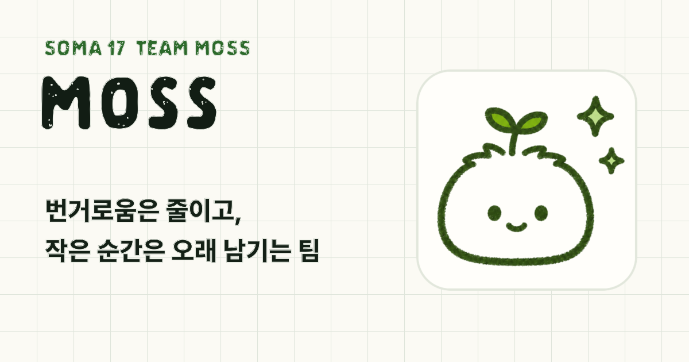

  

<h1 align="center">Moss</h1>

  <strong>Less hassle, tiny delights, fine details.</strong>

  번거로움은 줄이고, 작은 순간은 오래 남기는 팀

  <a href="https://soma17-moss.vercel.app">Website</a>

---

## 우리는 Moss예요

Moss는 SOMA 17기에서 만난 세 명의 개발자 팀이에요.

귀찮음을 끝까지 줄이고, 작은 순간은 오래 남게 만드는 제품을 만들어요.

우리는 제품이 요란하게 자신을 설명하지 않아도 된다고 믿어요. 사용자는 아무 생각 없이 편하게 지나가고, 가까이 들여다본 사람에게는 만든 사람의 집요함이 보이면 좋겠어요.

  

## 왜 Moss인가요

이끼는 작아 보이지만 끈질겨요.

콘크리트 틈, 그늘진 바위, 다른 식물이 쉽게 자리 잡지 못하는 곳에서도 자기 결을 만들어요. 화려하지 않아도 가까이 보면 정교하고, 한번 자리 잡으면 쉽게 사라지지 않아요.

우리가 만들고 싶은 제품도 그래요. 요란하지 않지만 오래 남고, 작아 보여도 쉽게 무너지지 않는 것. 사용자의 일상에 자연스럽게 붙어 있다가, 문득 돌아봤을 때 잘 만들었다는 생각이 드는 것.

## 우리가 중요하게 보는 것

| Less Hassle | Tiny Delight | Fine Details |
| --- | --- | --- |
| 사용자가 한 번 더 누르고, 입력하고, 확인하는 일을 줄여요. | 기능 너머의 작은 순간까지 제품의 일부로 봐요. | 보이지 않는 흐름과 작은 차이까지 끝까지 챙겨요. |

## 팀원

| 박준이 | 김동인 | 김상호 |
| --- | --- | --- |
| **AI Service Builder** | **Backend Diplomat** | **Backend Precision** |
| 프론트엔드부터 AI 서빙, AI 에이전트, 실사용자 유치까지 서비스의 끝을 잡아요. | 백엔드를 단단히 깔고, 사람과 기회를 제품 쪽으로 연결해요. | 데이터 흐름과 예외를 차분히 따라가며, 작은 불안정성을 놓치지 않아요. |
| 귀찮은 게 싫어서, 귀찮음을 없애는 더 귀찮은 일을 먼저 해요. | 사소한 순간에 진심을 다하고, 관계가 필요한 순간에는 먼저 움직여요. | 사용자가 의식하지 못한 채 믿고 쓰는 상태를 좋아해요. |

## Website

Moss 랜딩 페이지는 여기에서 볼 수 있어요.

[soma17-moss.vercel.app](https://soma17-moss.vercel.app)
